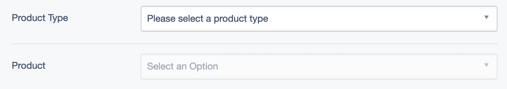

# silverstripe-dependentgroupeddropdownfield

A SilverStripe grouped dropdown field that has its options populated via ajax, based on the value of the dropdown field it depends on.

Note - this has been changed from v4+ from a fork of Shea Dawson's [silverstripe-dependentdropdownfield](https://github.com/sheadawson/silverstripe-dependentdropdownfield) to an extension of it instead. That is, the DependentGroupedDropdownField in this module is a subclass of the source DependentDropdownField.

## Requirements

SilverStripe 6.x

## Installation

`composer require fromholdio/silverstripe-dependentgroupeddropdownfield`

## What exactly is this?



See [user guide](docs/en/userguide.md) for usage screenshots.

## Usage example

First, create the `DropdownField` that your new field's values will be dependent on.

```php
$typeField = DropdownField::create(
    'ProductType',
    'Product Type',
    [
        'animal' => 'Animal',
        'food' => 'Food'
    ]
);

$typeField->setEmptyString('Please select a product type');
```

Note: it is not necessary for the original dropdown field to have an empty string. If it doesn't, its first value will be used to auto-load the optgroups/options into your dependent field.

Second, create a callable function that returns an array suitable for the $source parameter of GroupedDropdownField. (A two dimensional array; the first level is used for the optgroup, and the second level for the <options> of each group.)

```php
$productFieldSource = function($value) {
    if ($value === 'animal') {
        return [
            'Fun' => [
                'puppy' => 'Puppy',
                'dog' => 'Dog'
            ],
            'Evil' => [
                'cat' => 'Cat'
            ]
        ];
    }
    if ($value === 'food') {
        return [
            'Fruit' => [
                'apple' => 'Apple',
                'orange' => 'Orange'
            ],
            'Vegetables' => [
                'carrot' => 'Carrot',
                'celery' => 'Celery'
            ]
        ];
    }
    return [];
};
```

Now, create your `DependentGroupedDropdownField`, setting the source as the callable function created above.

```php
$productField = DependentGroupedDropdownField::create(
    'Product',
    'Product',
    $productFieldSource
);
```

Ensure that you connect the fields:

```php
$productField->setDepends($typeField);
```

And now you're ready to go.

```php
$fields->addFieldsToTab(
    'Root.Testing',
    [
        $typeField,
        $productField
    ]
);
```
