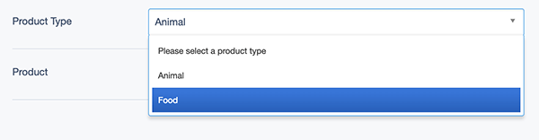
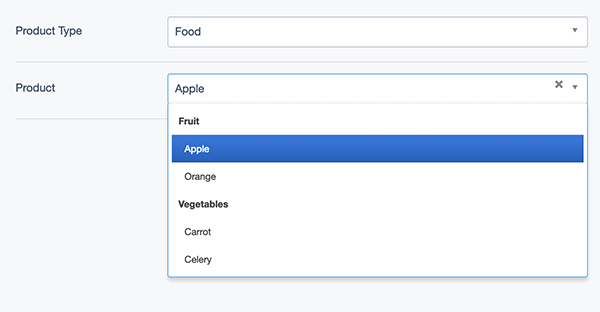
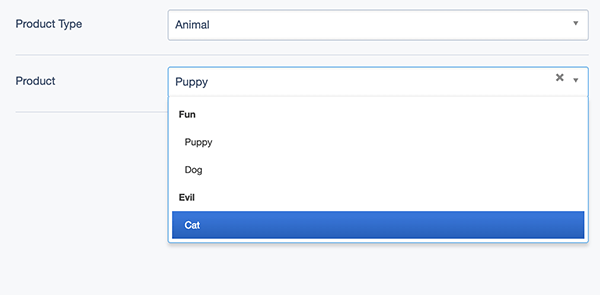

# User Guide

On initial load:

Select a product type:

Now your dependent field has loaded its optgroups/options and you can make a selection:

If you change your product type, your dependent field auto-reloads its available options:

